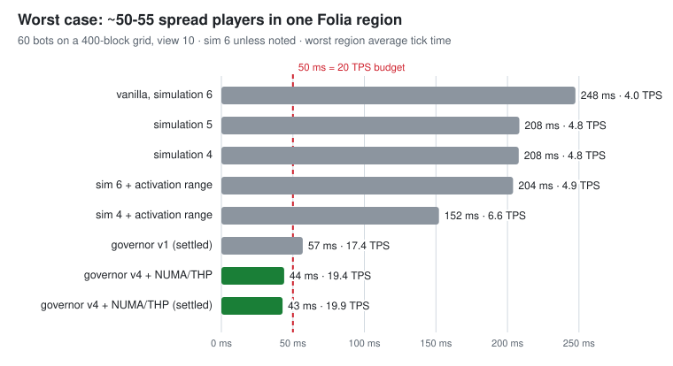
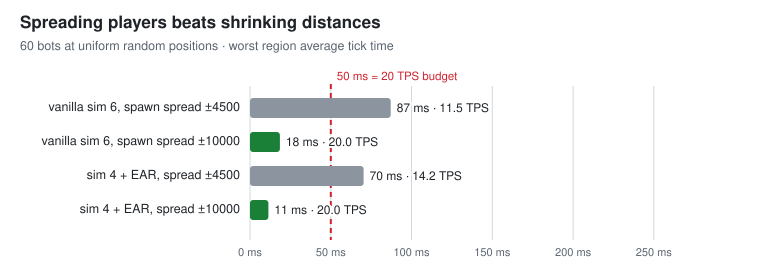

# Folia Spawn Governor

A Folia plugin that throttles natural mob spawning **only in regions that are actually lagging**, plus the benchmark
and notes that led me to write it. [한국어](README.ko.md)

The short version: Folia ticks each region on its own thread, and a region can end up much bigger than you'd expect.
In my bot tests, about 50 spread-out players ended up chained into a single region, and that region ran at
4 TPS (247 ms per tick). With this plugin (and a NUMA / huge-page JVM setup) the same case held 19.4–19.9 TPS.
Regions that are fine are never touched, so most of the time the server is plain vanilla.



## How it behaves

- Region's 5-second average tick ≤ 42 ms: nothing happens.
- Above that: natural spawn ticks are skipped for that region only, by cancelling Paper's
  `PlayerNaturallySpawnCreaturesEvent` for its players. Existing mobs follow normal despawn rules, so mob density drifts
  down only as far as needed, and spawning comes back once the region recovers.
- Still above 46 ms with spawning fully cut: mobs vanilla could despawn anyway (far hostiles, bats, fish, squid) go a bit
  sooner, without drops. Named, leashed or ridden mobs, animals, villagers, bosses and raids are never touched.

Animals, villagers, breeding, iron golems, raids, patrols, phantoms, spawners and farms keep working as usual.
The design went through four versions before this one; [docs/controller-design.md](docs/controller-design.md) has the history.

## Why regions get so big

Folia's regioniser counts every chunk *holder*, including about 12 rings of `INACCESSIBLE` holders from ticket
propagation, and pads regions with empty sections. So players roughly 1,000–1,100 blocks apart still end up on one thread.
In the same 60-bot bench, lowering simulation distance to 4 only saved 10–25%, while spreading first-join spawns wider
(±4500 → ±10000) kept every region at 20 TPS with vanilla settings. Details and code references:
[docs/region-merging.md](docs/region-merging.md).



## Build and use

JDK 25 and Maven.

```bash
cd plugin && mvn package      # also runs the 8 unit tests
```

Drop `plugin/target/spawn-governor-1.0.0.jar` into `plugins/` and restart. Settings live in
`plugins/SpawnGovernor/config.yml` (target, hold band, despawn assist). `/spawngovernor` lists tracked regions,
`/spawngovernor reload` applies config changes, and overloaded regions are logged every 30 s.

## Running the benchmark yourself

Only on a separate test server with `online-mode=false` and a copy of your world, never with real players.

1. Put `bench/probe` on the test server.
2. `cd bench/clients && npm install`, then `node clients.js <host> <port> <version> bench` and raise `count` in `control.json`.
3. Arrange the bots from the console: `/spawnbench chain 400`, `grid 650` or `random 10000`.
4. Capture with `/profiler world 0 0 177 8000` and summarise with `bench/analysis/parse_profiler.py <folder>`.

Raw numbers are in `results/measurements.csv` (48 phases).

## Caveats

Everything was measured with bots, not people. In village-heavy areas with ~50 spread players it bottoms out around
60–70 ms, because it deliberately leaves animals and villagers alone. `RegionClock` reads Folia internals through
reflection, so a Folia update can break it. More in [docs/limitations.md](docs/limitations.md).

GPL-3.0-only.
